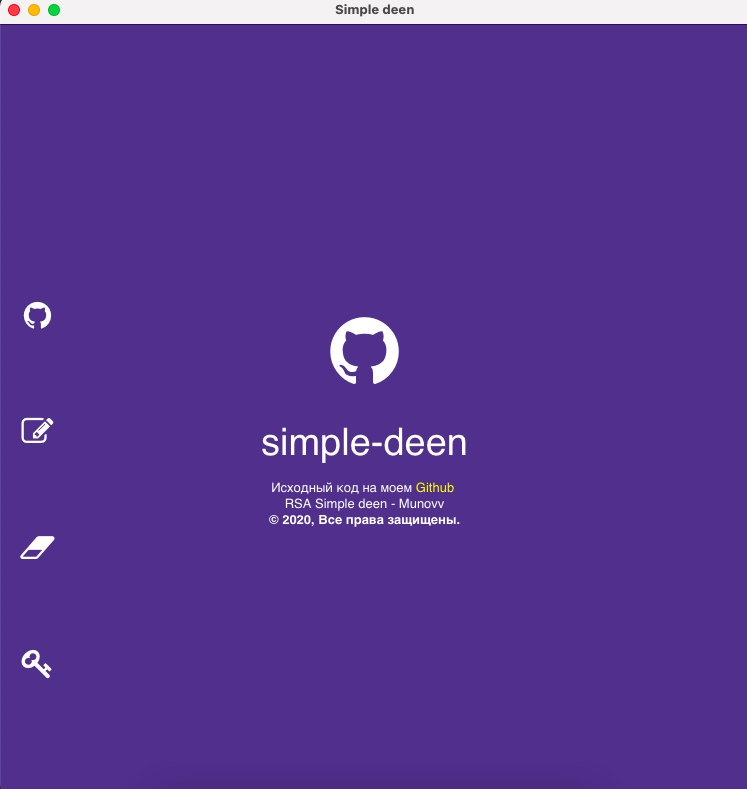

# RSA Simple Deen

RSA Simple Deen is an application for encrypting files and their contents. Supports 512/1024/2048 encryption key dimension.



## Before you start

### Requirements

You will need to install node.js on your computer if you have not done so beforehand.

```
node.js
```

Next, install the packages
```
npm install
```

### Run

```
npm start
```

## Assembly

```
npm run dist
```

## Written based on

* [Electron.js](https://electronjs.org/)
* [Node.js](https://nodejs.org/en/)
* [Bootstrap 4](https://getbootstrap.com/)

## Authors

* [Munovv](https://github.com/Munovv)
